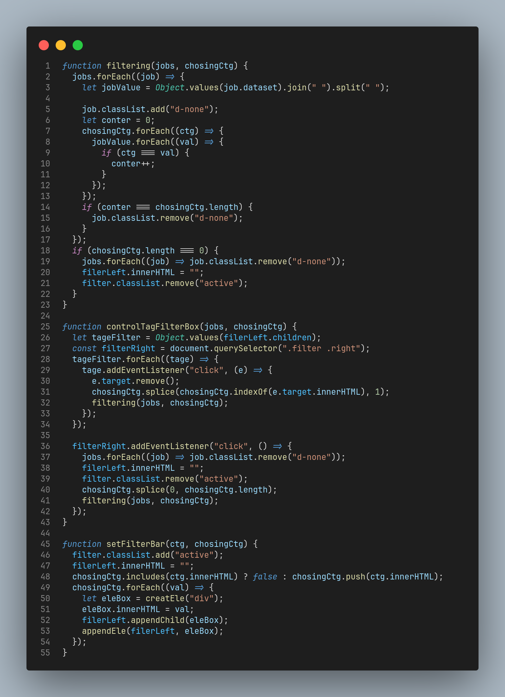

# Frontend Mentor - Job listings with filtering solution

This is a solution to the [Job listings with filtering challenge on Frontend Mentor](https://www.frontendmentor.io/challenges/job-listings-with-filtering-ivstIPCt). Frontend Mentor challenges help you improve your coding skills by building realistic projects.

## Table of contents

- [Overview](#overview)
  - [The challenge](#the-challenge)
  - [Screenshot](#screenshot)
  - [Links](#links)
- [My process](#my-process)
  - [Built with](#built-with)
  - [What I learned](#what-i-learned)
- [Author](#author)
- [Acknowledgments](#acknowledgments)

## Overview

### The challenge

Users should be able to:

- Filter job listings based on the categories
- See hover states for all interactive elements on the page
- View the optimal layout for the site depending on their device's screen size.

### Screenshot

### Links

- Solution URL: [Solution URL here](https://github.com/styrexx/static-job-listings)
- Live Site URL: [Live site URL here](https://styrexx.github.io/static-job-listings)

## My process

### Built with

- Semantic HTML5 markup
- Flexbox
- CSS Grid
- CSS custom properties
- [Bootstrap](https://getbootstrap.com/) - For styles
- Mobile-first workflow

### What I learned

- I have learn the mecanizme to use function in useful way.
- I creat the Filter job listings based on the categories width pure js.
  

- I use the XMLHttpRequest() to Get the data

## Author

- Frontend Mentor - [Abdessamad](https://www.frontendmentor.io/profile/kop-left)
- github - [Abdessamad](https://www.github.com/styrexx)
